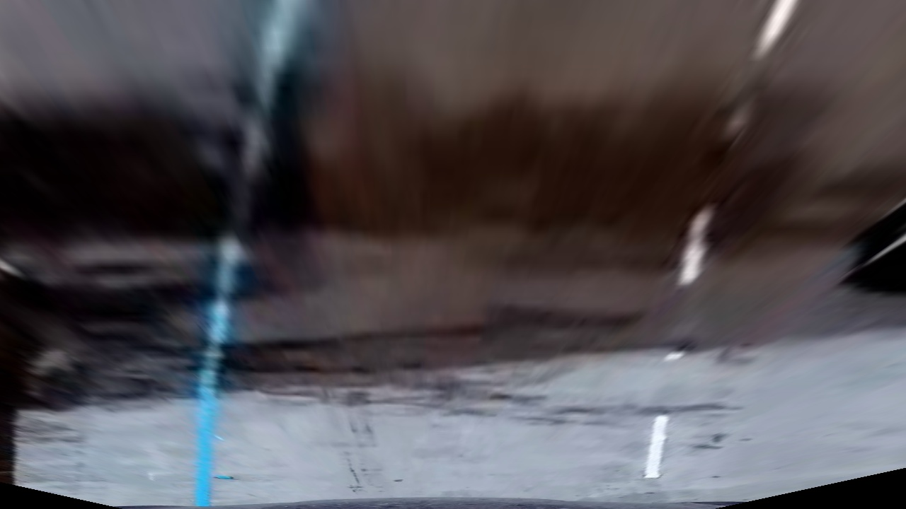
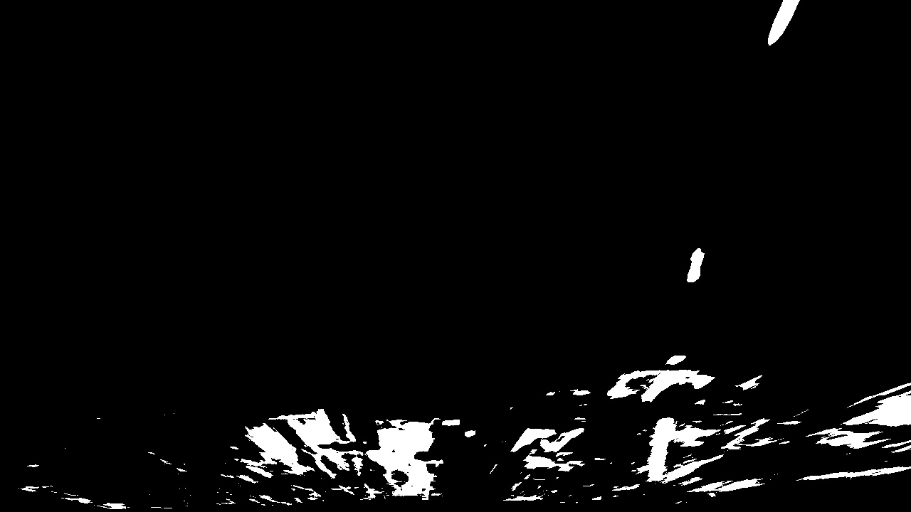
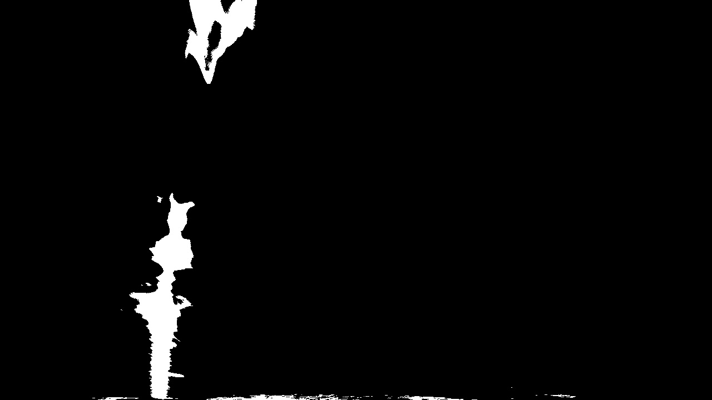
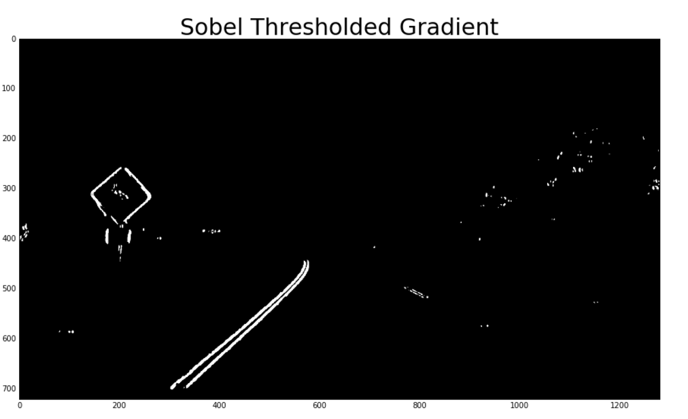
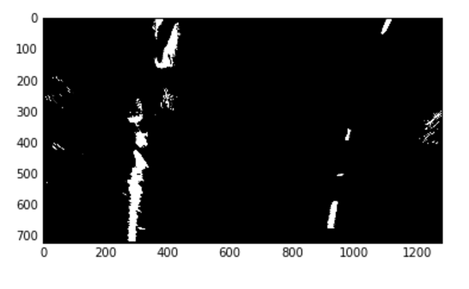
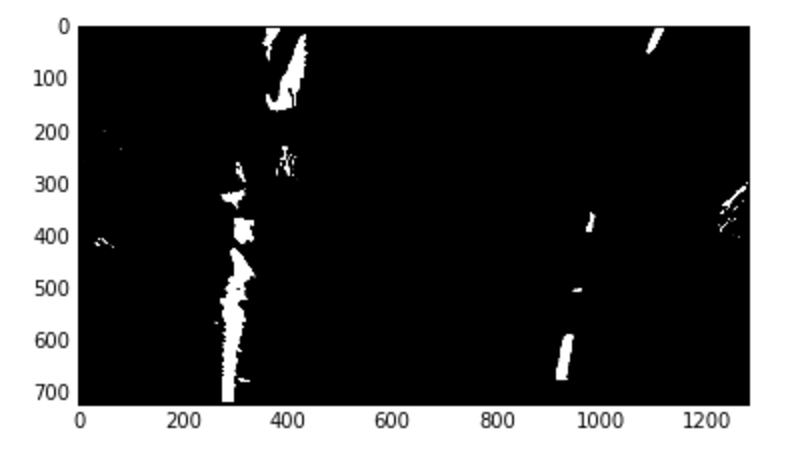
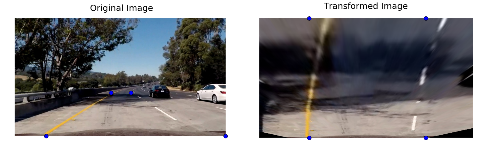
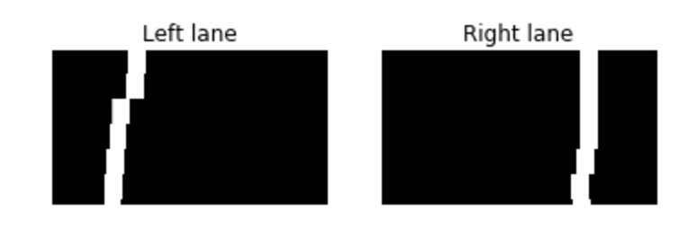
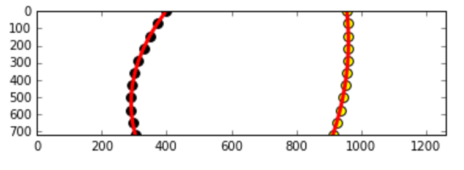
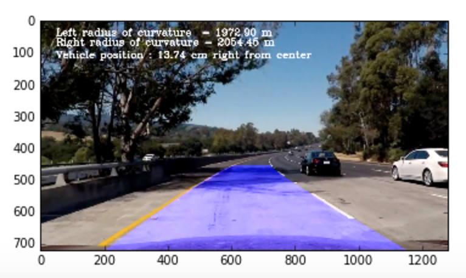

# Advanced Lane Finding Project

The goals / steps of this project are the following:

* Compute the camera calibration matrix and distortion coefficients given a set of chessboard images.
* Apply a distortion correction to raw images.
* Use color transforms, gradients, etc., to create a thresholded binary image.
* Apply a perspective transform to rectify binary image ("birds-eye view").
* Detect lane pixels and fit to find the lane boundary.
* Determine the curvature of the lane and vehicle position with respect to center.
* Warp the detected lane boundaries back onto the original image.
* Output visual display of the lane boundaries and numerical estimation of lane curvature and vehicle position.

### Camera Calibration

#### 1. Camera Matrix and Distortion Coefficients

Image distortion happens when 3D objects are shown in 2D. The different angles of pictures can create multiple perspectives of an image. This is an issue because there needs to be a universal way of interpreting images. There are tactics to undistort an image at an angle and re-create an image with the proper perspective.

I gathered object points with coordinates of (x, y, z). I assumed that z=0 so that I used the x and y coordinates of a distorted image and tried to straighten the points in the undistorted form. I used OpenCV's ```findChessboardCorners()``` function to match the corners on a 9x6 board. The object points were placed in the 'objpoints' array and every time I found the position of a corner I added it to the 'imgpoints' array.

I then used the output `objpoints` and `imgpoints` to compute the camera calibration and distortion coefficients using the `cv2.calibrateCamera()` function.  I applied this distortion correction to the test image using the `cv2.undistort()` function and obtained this result:

### Distorted


### Undistorted


The code for this step is contained in the IPython notebook located in "camera_cal.ipynb".

### Pipeline (test images)

#### 1. Distortion-corrected image
I applied the camera matrixes and distortion coefficients to the test images:

#### Original


#### Undistorted


#### 2. Color transforms and Gradients to create a thresholded binary image

I used a combination of color and gradient thresholds to generate a binary image

First I get white line and yellow line by using RGB to HSV color transformation.
The threshold of the HSV is as follows.

| Color Space | White Line    | Yellow Line   |
|:---------:  |:-------------:|:-------------:|
| H low       | 4             | 18            |
| H high      | 255           | 80            |
| S low       | 0             | 80            |
| S high      | 32            | 255           |
| V low       | 207           | 0             |
| V high      | 255           | 255           |

The binary image of the white and yellow line are below:
### White Line
#### Binary

#### Grayscale


### Yellow Line
#### Binary

#### Grayscale


The process can be found in the 'White Line Detection' and 'Yellow Line Detection' sections in 'pipeline.ipynb'.

### Sobel Threshold
When using an absolute sobel threshold, I used HLS color with a kernel size of 13, a min threshold of 90, and a max threshold to 225.
The process is in the 'Sobel Threshold' section of pipeline.ipynb

The binary image of sobel x thresholding is below.
(I applied the sobel to the original image to see the full effect of the transform)



(Both Lines: Sobel section of pipeline.ipynb)



I applied a Gaussian Blur to enlarge the size of the detected lines.
(Both Lines: Gaussian of pipeline.ipynb)



#### 3. Perspective transform

I used a `warp()` fucntion, which appears in the 'Perspective Transform' section of pipeline.ipynb.  The `warp()` function takes as inputs an image (`img`) and returns the transformed image, transformation matrixes, and inverse transformation matrixes. I hardcoded the source and destination points in the following manner:

```
 src = np.float32(
    [[585. /1280.*img_size[0], 455./720.*img_size[1]],
    [705. /1280.*img_size[0], 455./720.*img_size[1]],
    [1120./1280.*img_size[0], 720./720.*img_size[1]],
    [190. /1280.*img_size[0], 720./720.*img_size[1]]])

dst = np.float32(
    [[300. /1280.*img_size[0], 100./720.*img_size[1]],
    [1000./1280.*img_size[0], 100./720.*img_size[1]],
    [1000./1280.*img_size[0], 720./720.*img_size[1]],
    [300. /1280.*img_size[0], 720./720.*img_size[1]]])
```
This resulted in the following source and destination points:

| Source        | Destination   |
|:-------------:|:-------------:|
| 585, 455      | 300, 0        |
| 705, 455      | 1000, 0       |
| 1120, 720     | 1000, 720     |
| 190, 720      | 300, 720      |

I verified that my perspective transform was working as expected by drawing the `src` and `dst` points onto a test image and its warped counterpart to verify that the lines appear parallel in the warped image.



#### 4. Lane-line pixels and fit their positions with a polynomial

First I divided the image into 11 frames from top to bottom. Then, I take the moving average of the binary image of each frame. "1" means the pixel is white and "0" means the pixel is black. After calculating the moving average, I find the peaks of the histogram by using find_peaks_cwt. If the peaks are more than 2, I set the small number of them to the left lane pixel and large number of them to the right lane pixel. If only one peak is found, I have to decide if the peak is in the left or right lane. If no peaks are found, I used the previous lane pixel as the lane pixel. If the difference between the current peak location and previous peak location is more than 80 pixels, I set the current peak as the previous peak with no update. The window size is 40. ('Lane Detection Mask' section of pipeline.ipnb)



After getting left and right lanes, I set threshold again to each lane to find the better position. As for the left lane, I set the threshold as 0.3 and for the right lane, 0.3. Thus I got the lane pixels. To prevent detecting anomaly pixels (anomaly location), I chose 5 to 90 percentile of the pixels from the left and 1 to 95 percentiles of the pixels from the right. Finally, I got the x and y lane pixels from the image, So from these points, I fit the second order of polynomial.('Lane Curvature' section of pipeline.ipynb)



#### 5. Radius of curvature and vehicle position


The radius of the curvature is computed as following. The picture is in pixel value, so we have to transform it in meter scale.

```
ym_per_pix = 30/720 # meters per pixel in y dimension
xm_per_pix = 3.7/700 # meters per pixel in x dimension
```

Here, all_x and all_y is the pixels where lane line exists.
I fitted polynomial fit on the meter scale and then I calculated the curvature as in lecture as follows .
```
left_fit_cr = np.polyfit(all_x*ym_per_pix, all_y*xm_per_pix, 2)
y_eval = np.max(all_x)
left_curverad = ((1 + (2*left_fit_cr[0]*y_eval + left_fit_cr[1])**2)**1.5) \
/np.absolute(2*left_fit_cr[0])
```

I also calculated the vehicle position. I assume that the camera is on the center of the car. By calculating the average of left lane and right lane position, we can get the position of the car.

```
middle = (left_fitx[-1] + right_fitx[-1])//2
veh_pos = img_size[0]//2
dist_offset =100* (veh_pos - middle)*xm_per_pix # Positive means the car is  on  the right side , Negative means on left

```


#### 6. Provide an example image of your result plotted back down onto the road such that the lane area is identified clearly.

I've found lane lines so far. The lane lines are in the transformed image so I have to retransform it into the original image. I implemented this step in the 'Plot on image' section in pipeline.ipynb




### Pipeline (video)

The output of the pipeline is in the file 'output_project.mp4'

### Discussion

In this project, I learned how to find the lane lines of an image.
First, I calculated camera matrixes and distortion coefficients to undistort image. Then I transformed the color space from RGB to HSV to find white and yellow lines. Then I used sobel operation to detect edges. Finally I put it together and then used gaussian blur to identify the lane lines.

The procedure above may fail to detect lines when there are different types of lines on the road. There could be lines for crosswalks, stop signs, yield, and others. I could make the pipeline more robust by trying more winding images of roads and trying to see if the pipeline can work when there are adverse weather conditions distorting the vision of the road.
